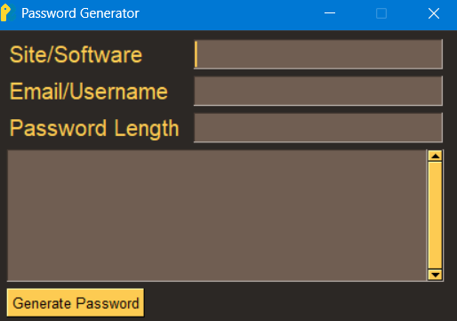
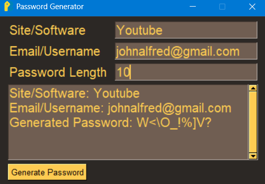
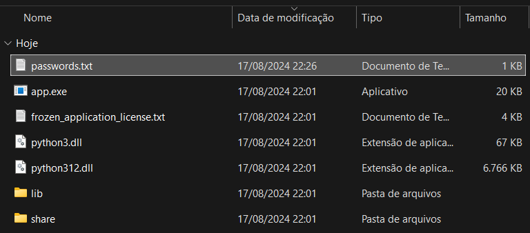

# Password_Generator_in_Python

## Overview

**Password_Generator_in_Python** is a lightweight and user-friendly desktop application designed to generate secure, random passwords. This tool allows users to create passwords of varying lengths and complexities, ensuring enhanced security for online accounts and sensitive data.

## Features

- **Customizable Length:** Generate passwords with your preferred length.
- **Instant txt file creation:** Directly created inside the Password Generator folder.
- **Lightweight and Fast:** The application is quick and responsive, offering instant password generation.

## Installation

1. **Download the Application:**

   Download the latest version of the Password Generator from the [Releases](https://github.com/FernanSoCar/Password_Generator/releases/tag/Password_Generator_v0.1) page.

2. **Run the Application:**

   Simply double-click the downloaded `.exe` file to run the application. No installation is required.

## Usage

1. Launch the app by double-clicking the `app.exe` file.
2. Use the interface to:
   - Set the desired password length.
   - Click the "Generate" button to create a random password.

## Screenshots

## Customization

This application is designed to be straightforward and easy to use. If you need a customized version or additional features, feel free to reach out or modify the source code if you're building from it.

## Contributing

Contributions to improve the app are welcome. To contribute:

1. Fork the repository.
2. Create a new branch for your feature or bug fix.
3. Submit a pull request with a detailed description of your changes.

## License

This project is licensed under the MIT License. See the [LICENSE](LICENSE) file for more details.

## Contact

For questions, suggestions, or issues, please open an issue on GitHub.
 
